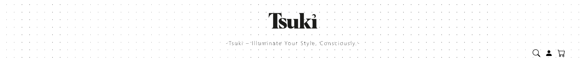

# Getting started

*This document is for frontend only.*

1. This is app is made with react.
2. Simply download the dependancies.
3. Use **npm start** to run the react app.

## Views/Components:

Here components and views are in same directory and for now (might be updated in future)

### 1. Home.jsx -

Just the home page nothing new.

### Header.jsx -

Its only the promo bar and has NOTHING to do with logo logo is part of navbar.

###Navbar.jsx -

simple and clean navbar.

###Footer.jsx-

simple footer but no working links.

###Contact.jsx-

simple clean contaact page.
